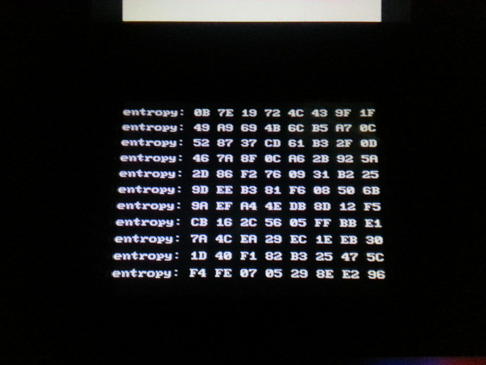

<!--
Copyright (c) 2022 Guilherme Janczak <guilherme.janczak@yandex.com>

Permission to use, copy, modify, and distribute this software for any
purpose with or without fee is hereby granted, provided that the above
copyright notice and this permission notice appear in all copies.

THE SOFTWARE IS PROVIDED "AS IS" AND THE AUTHOR DISCLAIMS ALL WARRANTIES
WITH REGARD TO THIS SOFTWARE INCLUDING ALL IMPLIED WARRANTIES OF
MERCHANTABILITY AND FITNESS. IN NO EVENT SHALL THE AUTHOR BE LIABLE FOR
ANY SPECIAL, DIRECT, INDIRECT, OR CONSEQUENTIAL DAMAGES OR ANY DAMAGES
WHATSOEVER RESULTING FROM LOSS OF USE, DATA OR PROFITS, WHETHER IN AN
ACTION OF CONTRACT, NEGLIGENCE OR OTHER TORTIOUS ACTION, ARISING OUT OF
OR IN CONNECTION WITH THE USE OR PERFORMANCE OF THIS SOFTWARE.
-->



## libnds_getentropy: getentropy() for the Nintendo DS and DSi
The library only runs on the DSi at the moment because I've taken a shortcut by
using the SHA1 functions which are only present in the DSi firmware.

## Usage
Link in the library in your ARM7 code BEFORE all the devkitPro libraries you
use.
```Make
LIBS := -lnds_getentropy7 -lnds7
```
In your ARM7 program:
```c
#include <nds_getentropy.h>

int
main(void)
{
	unsigned char entropy[20];

	...
	arm7_getentropy(entropy, sizeof(entropy);

	/* entropy now contains a random sequence of bytes. */
	...
}
```

The interface is almost the same as the BSD `getentropy()`:
https://man.openbsd.org/getentropy.2

The only difference is that `getentropy()` can be called from anywhere, whereas
`arm7_getentropy()` may only be called from the ARM7.
